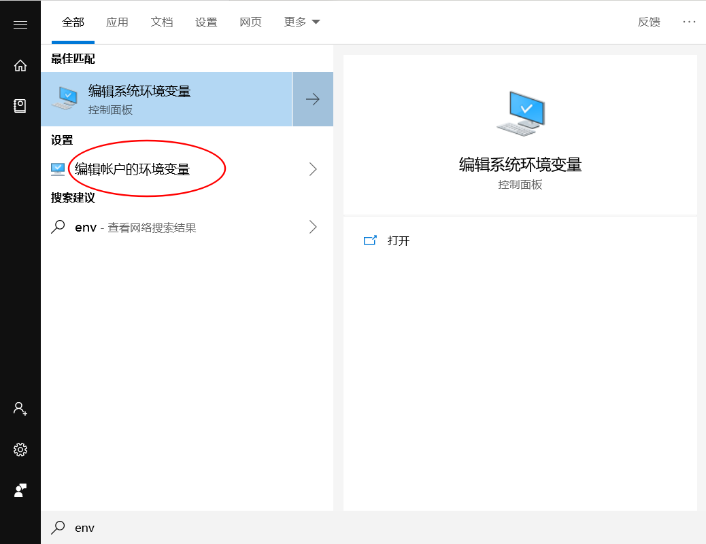

## flutter的安装

> 参考文档：https://flutter.io/docs/get-started/install

## Windows

### 环境依赖

- 操作系统：Windows 7 SP1（64位）之后
- 磁盘空间：最少400MB
- 工具：
  - Windows powershell（版本>=5.0）
  - Git for Windows 2.x
    - 如果 Git 已经安装，确保可以在 powershell 中使用 Git 命令

### 下载 Flutter SDK

- 下载地址
  - 官方下载地址：https://storage.googleapis.com/flutter_infra/releases/stable/windows/flutter_windows_v1.0.0-stable.zip
  - 国内镜像地址：https://storage.flutter-io.cn/flutter_infra/releases/stable/windows/flutter_windows_v1.0.0-stable.zip
- 解压到 `c:/dev/flutter` 中
- 找到 flutter 中的 `flutter_console.bat` 文件。双击打开。

### 更新环境变量

如果希望在 Windows 控制台使用 flutter 命令，则需要配置环境变量。

- 在开始菜单中输入 env，然后选择"编辑账户的环境变量"

- 在用户变量中找到 `Path` 环境变量
  - 如果 `Path` 存在，则将 `flutter\bin` 目录的完整路径以 `;` 作为分隔符放到 `path` 中
  - 如果 `Path` 不存在，则创建一个用户变量命名为 `Path`, 并写入 `flutter\bin` 的完整路径

## macOS